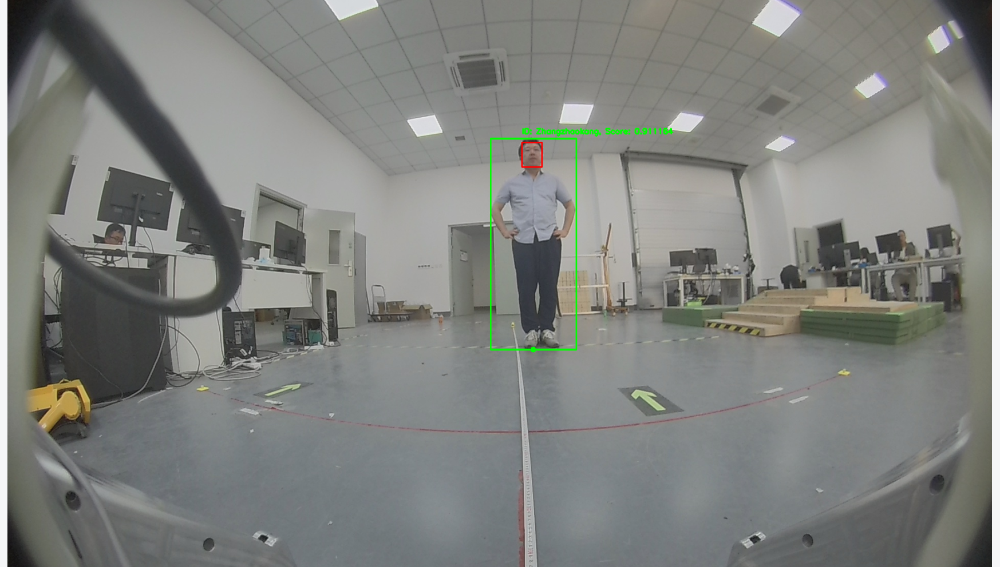
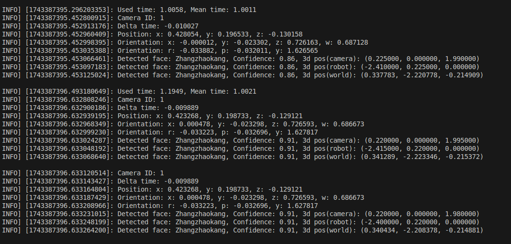

# FaceID识别

## 简介
face id 模块主要功能是获取主人落脚点在机器狗坐标系下的3D坐标。识别过程大概分为四步：第一步对图像中的人脸进行检测，并提取每个人脸的特征向量。第二步，根据语音模块发送过来的主人姓名和数据库中人脸数据库进行筛选匹配，获取到主人人脸在图像中的位置。第三步，使用YOLO算法进行人体检测，并通过人脸在图像中的位置进行人体匹配，获取到主人的人体在图像中的位置并计算落脚点在图像中的位置。第四步，根据人脸和人体在图像中的位置，通过IPM算法和坐标变换计算得到主人落脚点在机器狗坐标系下的3D坐标。

## 更新日志
* [2025.02.08]  添加face id 识别python代码，模型以及环境。
* [2025.02.28] 添加face id 识别C++代码，模型以及环境。
* [2025.03.28] 添加前后鱼眼融合代码。


## 训练

1. face 特征向量模型的训练参考[arcface](https://github.com/deepinsight/insightface/tree/master/recognition/arcface_torch)   
2. 人体检测模型的训练参考[yolo11](https://docs.ultralytics.com/modes/train/#usage-examples)
3. 人脸检测模型的训练参考[scrdf](https://github.com/deepinsight/insightface/tree/master/detection/scrfd)

## 部署

1. 硬件环境  
Orin NX, 森云鱼眼相机

2. 软件环境
* JetPack==5.1.2 。Orin上默认安装
* Ros1-noetic 。可参考[鱼香ROS一键安装教程](https://fishros.org.cn/forum/topic/20/%E5%B0%8F%E9%B1%BC%E7%9A%84%E4%B8%80%E9%94%AE%E5%AE%89%E8%A3%85%E7%B3%BB%E5%88%97?lang=en-US)
* tensorrt==8.5.2。 Orin上默认安装。
* Opencv+cuda==4.5.5。 可参照opencv官方教程或者[博客](https://blog.csdn.net/m0_64293675/article/details/142127890)安装。


3. 运行方法 
* 编译主程序  
    ```
    bash ./build.sh
    ```
* 编译ros接口,并启用  
    ```
    cd ros1_interface && catkin_make
    source ros1_interface/devel/setup.bash
    ```

* 离线数据测试  
    离线数据存放在NAS上，路径为```$NAS/端侧感知/人脸ID/data```，其中```$NAS```为NAS的地址，需要根据实际情况修改。离线数据以roabag包格式存储，可以任意找到一个数据包进行播放。   
    * 新建一个终端，运行roscore。```roscore```
    * 新建一个终端，运行rosbag播放。```rosbag play -l 2025-03-26-15-14-07_back_2m.bag```
    * 新建一个终端，运行程序。``` ./run_test.sh```。 可视化结果如下图所示   
       
    终端打印运行结果如下图所示   
    
       
        
* 真机测试
    * 运行鱼眼相机SDK
    * 运行程序   
    ``` ./run.sh```


4. 参数配置   
config文件架下存放了目前所有机器狗的配置文件，其中默认配置文件为default.json文件。可以根据不同的机器狗平台进行配置文件的修改。下面将介绍配置文件中各个参数的含义。其中加粗的是可以根据实际情况进行修改的，没有加粗的一般不用修改。   
    * database_path : 人脸特征向量数据库的路径，默认为“data/known_people/database-resnet50.json",一般不需要修改。
    * name2id_path : 人脸id与姓名的对应关系，默认为“data/known_people/name2id.json",一般不需要修改。
    * camera_parameter : 相机参数，包括相机内参、畸变系数、相机外参、图像尺寸以及3D标定参数。其中相机内参和畸变系数可以通过相机内参标定得到，相机外参可以通过相机外参标定得到，图像尺寸可以通过相机参数得到，3D标定参数可以通过本仓库中utils/calibration_tools.py这个标定工具标定得到。这个相机参数是一个数组，可以支持多个相机。
        * **fisheye_rostopic** : 鱼眼相机图像的ros话题。前侧的鱼眼相机图像的话题默认为“/cam_front_fish/csi_cam/image_raw/compressed”。后侧的鱼眼相机图像的话题默认为“/cam_back_fish/csi_cam/image_raw/compressed”可以根据实际情况修改。
        * **camera_intrinsics** : 相机内参，是一个3x3的矩阵，可以根据实际情况修改。
        * **camera_distortion** : 相机畸变系数，是一个1x4的向量。可以根据实际情况修改。
        * **camera2robot_extrinsic** : 相机外参系数，是一个4✖4矩阵。可以根据实际情况修改
        * **image_size** : 图像尺寸，是一个1x2的向量，默认是1920x1536。可以根据实际情况修改。
        * **3d_calibration_parameter** : 3D标定参数，描述了2D像素到3D坐标的映射关系，可以通过本仓库中utils/calibration_tools.py这个标定工具标定得到。可以根据实际情况修改。标定方法详见ipm标定。

    * model_paramter : 模型相关参数。
        * face_detector : 人脸检测模型参数，包括模型路径、置信度阈值、NMS阈值、是否build engine标志位。
            * **model_path** : 模型路径，默认为“weights/det_10g.onnx”。可以根据实际情况修改。虽然写的是onnx模型，但是实际运行的是tensorrt的engine模型。
            * **confidence_threshold** : 置信度阈值，默认为0.5。可以根据实际情况修改。
            * **nms_threshold** : NMS阈值，默认为0.5。可以根据实际情况修改。
            * build_engine : 是否build engine标志位，默认为false。如果没有engine模型时，需要将这个标志位置为true，则会在程序运行前build engine生成engine模型。
        * face_recognition : 人脸识别模型参数，包括模型路径、置信度阈值、是否build engine标志位。
            * **model_path** : 模型路径，默认为“weights/resnet50.onnx”。可以根据实际情况修改。虽然写的是onnx模型，但是实际运行的是tensorrt的engine模型。
            * **confidence_threshold** : 置信度阈值，默认为0.7。可以根据实际情况修改。
            * build_engine : 是否build engine标志位，默认为false。如果没有engine模型时，需要将这个标志位置为true，则会在程序运行前build engine生成engine模型。
        * body_detector : 人体检测模型参数，包括模型路径、置信度阈值、NMS阈值、是否build engine标志位。
            * **model_path** : 模型路径，默认为“weights/yolov11m-pose.onnx”。可以根据实际情况修改。虽然写的是onnx模型，但是实际运行的是tensorrt的engine模型。
            * **confidence_threshold** : 置信度阈值，默认为0.6。可以根据实际情况修改。
            * **nms_threshold** : NMS阈值，默认为0.5。可以根据实际情况修改。
            * build_engine : 是否build engine标志位，默认为false。如果没有engine模型时，需要将这个标志位置为true，则会在程序运行前build engine生成engine模型。一般不需要修改
    